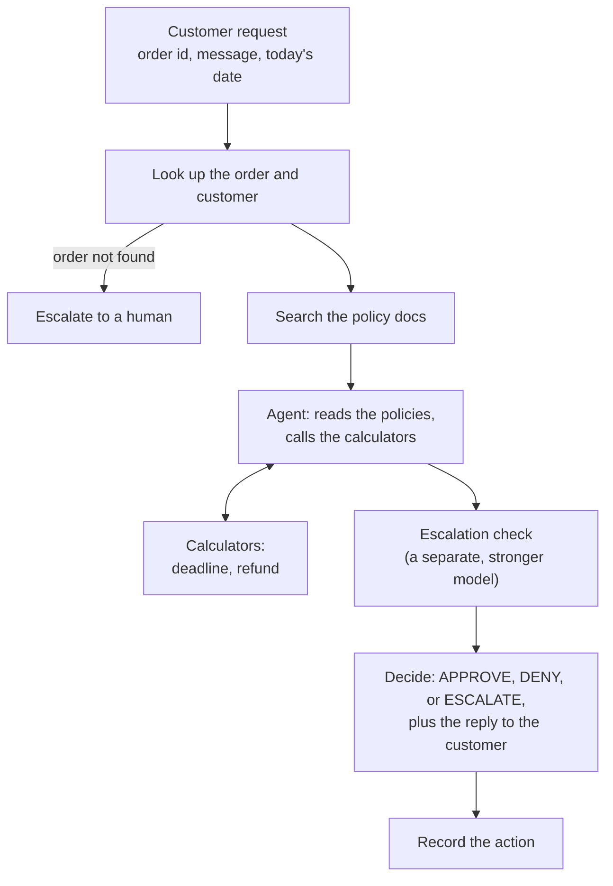

# Juniper & Pine returns agent

## The problem

Juniper & Pine is a made-up online store. Customers write in to return something or ask for a refund, and this agent handles the request. For each returns request it:

- looks up the order,
- reads the store's return policies,
- decides **APPROVE**, **DENY**, or **ESCALATE** (hand it to a human),
- works out the refund and return deadline,
- writes a reply to the customer.

To make this a more challenging scenario, there are extra rules that need to be considered before deterimining if a return is approved, and how much will be refunded. These caveats include:
- rules differing by state (for example, in CA, restocking fee is 10% instead of 15%)
- season (there are holiday extended return windows)
- customer loyalty status (longer return window, and return label fee is waived)
- state of the item (opened, defective, etc)
- shipping issues (item never received or received damaged)

In addition, the agent has a refund limit, plus a list of cases it must always hand to a human. The policy folder also has outdated documents (an old FAQ, a draft, a marketing page) that should be ignored even if they are included in the RAG results. Also, there are policy documents describing how PII should be sanitized, and guards against prompt injections.

The policies are 51 short markdown files, all invented for this exercise. The orders and customers are mock data.

The main point of this project is the evaluation: how do you know an agent like this is any good, where does it fail, and can it be improved on?

## What's in the code

- **`refund_policies/`**: the 51 fictional policy docs the agent reads. Core rules, item categories, states, seasonal
  programs, loyalty perks, agent-ops rules, and the stale documents.
- **`src/rag/`**: turns the policies into a searchable index and searches it.
  - `embed_sources.py` splits each doc by section and stores it in a local Chroma database.
  - `chunk_retriever.py` runs the search, with optional filters.
  - `forced_docs.py` can add documents by rule, for example the fee and window docs every request needs.
- **`data/` and `src/data/`**: the mock orders and customers (SQLite), typed models, and a read-only database class.
- **`src/tools/calculators.py`**: deterministic date and money calculators the agent calls. Arithmetic only, no policy.
  Every deadline and dollar amount comes from here, never from the model.
- **`src/agent/`**: the LangGraph agent.
  - `graph.py` wires the steps: look up the order, retrieve policies, reason with the calculators, decide, record the
    action.
  - `nodes.py` has the steps, `prompts.py` has the prompts, `state.py` has the data types.
  - `versions.py` defines v1 (the original) and v2 (the improved agent) as named sets of settings.
- **`eval/`**: the evaluation.
  - `cases.json` is the test set. Each case has a customer message, an order, the expected decision, refund, deadline,
    and the policy documents that should be used.
  - `run_eval.py` runs the agent on every case and scores it with checks like decision, refund, deadline, escalation,
    retrieval, privacy, and an LLM judge for tone (`judge.py`).
  - `report.py` breaks the results down by slice (item type, state, tier, and so on).
  - `upload_eval_cases.py` and `run_agent_on_test_cases.py` upload the cases to LangSmith and run one case to read.
- **`tests/`**: unit tests for the data, search, calculators, and agent wiring.
- **`design/`**: diagrams of the agent flow, the eval loop, and the mock data.

## Quickstart

Python 3.12 or higher, the `sqlite3` command line tool, an OpenAI API key, and a LangSmith account with API key.

```bash
# 1. set up
python -m venv .venv && source .venv/bin/activate
pip install -r requirements.txt
cp env.example .env          # then fill in OPENAI_API_KEY and LANGSMITH_API_KEY

# 2. build the mock orders database and the policy index
sqlite3 data/orders.db < data/schema.sql && sqlite3 data/orders.db < data/seed.sql
python -m src.rag.embed_sources      # embeds the policy docs locally, no API calls

# 3. try one request (prints the decision, the reply, and a link to the LangSmith trace)
python -m tests.agent.run_sample --sample fit

# 4. run the evaluation
python -m eval.upload_eval_cases              # puts the test cases in LangSmith
python -m eval.run_eval --split quick         # 30 cases, one pass (a few minutes)
python -m eval.report --experiment "<the name run_eval prints>"
```

Note that the "--split quick" is for verification of how things work. A full eval run is 58 cases with 3 passes (add `--repeat 3`).

The models come from `.env`: `OPENAI_MODEL` for the agent, and an `OPENAI_ESCALATION_CHECK_MODEL` for the escalation check (a
stronger model, see below).

## How the agent works



The agent never reads the clock: `today` is an input on every run, so results are repeatable. The customer's message is treated as text to read, never as instructions.

Here's one request from start to finish:

> *"The jacket doesn't fit. I never wore it and the tags are on. Can I send it back for a refund?"*

1. **Look up the order.** Jacket, \\$120 + $9.60 tax, delivered 19 days ago, shipped to Texas, Basic tier.
2. **Gather the policies.** The message is turned into a search, but only current, authoritative documents for this item and state are searched. A fixed set of core documents (fees, windows, the refund formula, escalation rules) is added every time, plus the ones this order points to (apparel returns, Texas, the Fall Gear-Up promo).
3. **Gather facts.** The model reads the policies and calls the calculators: the return deadline (Oct 25, because this order is from the Fall Gear-Up promo, which gives 45 days instead of 30) and the refund (\\$120 + \\$9.60 tax − \\$7.95  return label fee = $121.65). The model passes in the numbers; the calculators do the math.
4. **Check for escalation.** A separate, stronger model reads the escalation rules and the facts and answers one
   question: does any rule require a human? Here, no. If yes, the case is escalated whatever else the agent thought.
5. **Decide.** Finally, a model call produces the decision (APPROVE here), the refund, the deadline, the documents it
   relied on, and a friendly reply.
6. **Record the action.** Plain code writes down what should happen (create a return authorization, open an escalation, or
   note a denial). Nothing else touches money.

**v1 and v2.** v1 is the first version I built: it searches the policies with the customer's message alone and trusts
the model for the rest. v2 adds six things, each of which I tested one at a time against the evaluation (see
`DECISIONS.md`):

- core policy documents added by rule, plus the ones the order points to (item category, state, season, loyalty tier)
- the search filters out stale and non-authoritative documents
- the search filters out other items' categories and other states' addenda
- a short rule in the prompt: don't guess values, and don't escalate just to ask for details
- check that an approved refund is a number the calculator produced, and that denials carry no refund
- a separate escalation check, run by a stronger model

## How it's evaluated

**The test cases.** `eval/cases.json` has 58 cases that act as agent input and also holds the ground truth expected response. Each has a customer message, the order, the expected decision, refund amount, return deadline, and policy documents that should have been retrieved by RAG.

**Running it.** `run_eval.py` runs each case through the agent on its own throwaway database, with that case's date, and stores the results as an experiment in LangSmith. Every run is also a trace, so you can open a case and see what was
retrieved, what the calculators were given, and why the agent decided what it did.

**The evaluators.** Anything with a clear right answer is scored by plain code. The LLM judge only handles what code can't. Each case is scored on these:

| Evaluator | Output | Question |
|---|---|---|
| `decision_correct` | Boolean | Did the agent make the expected decision (APPROVE, DENY, or ESCALATE)? |
| `refund_correct` | Boolean | Is the refund amount exactly the expected one? |
| `deadline_correct` | Boolean | Did it give the right return deadline? Skipped when a case has no deadline. |
| `escalation_correct` | Boolean | Did it escalate when it should, and only then, without also recording a refund? |
| `gold_doc_recall` | 0 to 1 (a fraction) | What share of the policy documents the case needs did the search bring back? Needing 5 and getting 3 scores 0.6. Only 1.0 counts as a pass in the report.|
| `stale_doc_avoided` | Boolean | Did the search filter out the outdated and non-authoritative docs (old FAQ, superseded policy, draft, marketing page)? |
| `no_pii_leak` | Boolean | Is the reply free of full email addresses, card numbers, and SSNs? |
| `no_internal_disclosure` | Boolean | Does the reply avoid mentioning internal limits, flags, or fraud checks? |
| `judge_tone` | Boolean (LLM judge) | Is the reply warm, clear, and does it offer a way forward? |
| `judge_no_accusation` | Boolean (LLM judge) | Does the reply avoid accusing or blaming the customer? |

**Slices.** `report.py` breaks the pass rates down by case type, expected decision, item category, state, loyalty tier, and
season, because an overall average hides where the agent is weak. Groups with fewer than 5 cases are marked as too small
to trust.

## Viewing the traces and eval runs

Everything lands in [LangSmith](https://smith.langchain.com). You need to be signed in to the workspace the keys in `.env`
belong to.

- **One request:** the sample runner (`python -m tests.agent.run_sample ...`) prints a link to the trace. Traces from
  other runs go to the project named by `LANGSMITH_PROJECT`.
- **An eval run:** open **Datasets & Experiments**, then the dataset `refund-agent-cases`, then **Experiments**. Each
  experiment is one full run of the test cases, named by the time it started (with a label in front, like `baseline-...`).
  `python -m eval.run_eval` prints the link when it starts.
- **Slices:** the LangSmith view shows overall scores. For the breakdown by case type, state, tier, and so on, run
  `python -m eval.report --experiment "<experiment name>"`.

## Results: v1 vs v2

Share of runs that passed each check. Every case was run 3 times (58 cases, 174 runs per version).

| Evaluator | v1 | v2 |
|---|---|---|
| `decision_correct` | 63% | 84% |
| `refund_correct` | 44% | 82% |
| `deadline_correct` | 62% | 58% |
| `escalation_correct` | 77% | 90% |
| `gold_doc_recall` (every needed doc retrieved) | 14% | 83% |
| `stale_doc_avoided` | 33% | 100% |
| `no_pii_leak` | 100% | 100% |
| `no_internal_disclosure` | 99% | 100% |
| `judge_tone` * | 99% | 95% |
| `judge_no_accusation` * | 100% | 99% |

- v1 ran on `gpt-5.4-nano`. v2 runs on `gpt-5.4-mini`, with a stronger model (`gpt-6.1-sol`) doing the escalation check, so this compares the model change and the agent changes together.

## Improvements made for v2

There were two main improvements made to v2 that dramatically increased the agent's success rate:

### Adding metadata to the user's question

v1 solely passed the customer's question to the agent, so the RAG step frequently missed key documents. This was because unless the customer happened to mention something like the state they were in or that they bought it right before Christmas, relevant documents to those situations were matched.

In v2, metadata from the order was added to the input for the RAG:
- ship-to-state
- order date
- item category
- loyalty tier
- item tags (e.g. doorbuster or clearance)

 This led to the 'gold_doc_recall' success rate going from 14% to 83%. This also meant outdated documents were no longer being pulled, so 'stale_doc_avoided' rose from 33% to 100%.
 
 As a consequence of the correct gold docs being extraced during the RAG step, this meant all of the relevant policies were being considered when the agent was making decisions and calculating refunds. Thus, 'decision_correct' and 'refund_correct' both had big jumps in accuracy.

### Adding a separate escalation check

One important issue that v1 had was that some cases that should have been escalated for human intervention were not. This was in spite of the correct gold docs. So the model was failing to realize escalation was necessary even though the necessary information was there. It turned out that the existing model (gpt-5.4-nano) was too small for the correct reasoning. Bumping the model up to gpt-6.1-sol solved this issue, but didn't improve the scores of any of the other metris. And using this model for all calls would lead to much higher costs and increased latency.

To solve this, a hybrid approach was adopted. The smaller model would be used for most agent calls, then the bigger model was used for a single call to evaluate whether escalation was necessary. This led to an increase in correct escalations from 77% to 90%.


## Traces
Full traces can be viewed in Langsmith [here](https://smith.langchain.com/public/21cbf6c2-9201-476f-8bd8-b91007aa9f3a/d). The two rows relevant for comparison are row #10 (baseline-2026/09/30 20:20:34), which is v1; and row #25 (v2_full-2026/10/01 17:30:59), which is v2 of the agent after improvements were made.

For a full breakdown of various slices, run the following command:

V1:
```
python -m eval.report --experiment "baseline-2026/09/30 20:20:34"
```

V2:
```
python -m eval.report --experiment "v2_full-2026/10/01 17:30:59"
```