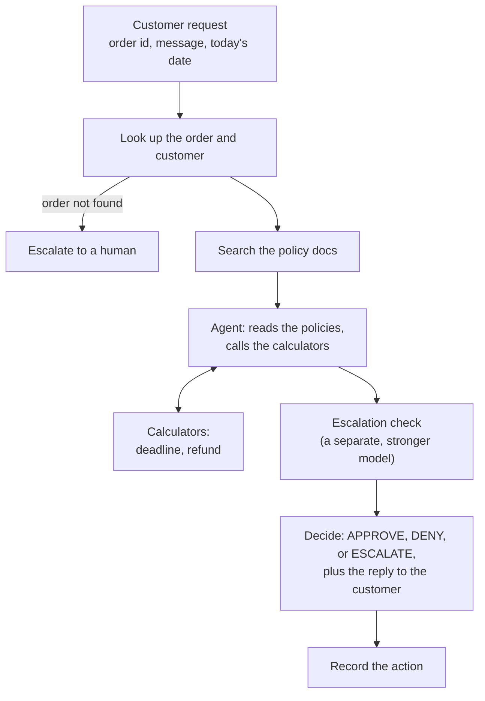

# Juniper & Pine returns agent

## The problem

Juniper & Pine is a made-up online store in the US. Customers write in to return something or ask for a refund, and
this agent handles the request. For each one it:

- looks up the order,
- reads the store's return policies,
- decides **APPROVE**, **DENY**, or **ESCALATE** (hand it to a human),
- works out the refund and return deadline,
- writes a reply to the customer.

It sounds simple, but the rules are fiddly. Return windows depend on the item type, the ship-to state, the customer's
loyalty tier, and seasonal promos, and they never stack: the customer gets the single latest deadline. Fees and waivers
depend on the same things. The agent has a spending limit, plus a list of cases it must always hand to a human. The policy
folder also has outdated and non-authoritative documents (an old FAQ, a draft, a marketing page) that look like real
policy but aren't. And whatever the customer types is untrusted text, not instructions.

The policies are 51 short markdown files, all invented for this exercise. The orders and customers are mock data.

The main point of this project is the evaluation: how do you know an agent like this is any good, where does it fail,
and does a change actually help?

## What's in the code

- **`refund_policies/`**: the 51 fictional policy docs the agent reads. Core rules, item categories, states, seasonal
  programs, loyalty perks, agent-ops rules, and the stale documents.
- **`src/rag/`**: turns the policies into a searchable index and searches it.
  - `embed_sources.py` splits each doc by section and stores it in a local Chroma database.
  - `chunk_retriever.py` runs the search, with optional filters.
  - `forced_docs.py` can add documents by rule, for example the fee and window docs every request needs.
- **`data/` and `src/data/`**: the mock orders and customers (SQLite), typed models, and a read-only database class.
- **`src/tools/calculators.py`**: deterministic date and money calculators the agent calls. Arithmetic only, no policy.
  Every deadline and dollar amount comes from here, never from the model.
- **`src/agent/`**: the LangGraph agent.
  - `graph.py` wires the steps: look up the order, retrieve policies, reason with the calculators, decide, record the
    action.
  - `nodes.py` has the steps, `prompts.py` has the prompts, `state.py` has the data types.
  - `versions.py` defines v1 (the original) and v2 (the improved agent) as named sets of settings.
- **`eval/`**: the evaluation.
  - `cases.json` is the test set. Each case has a customer message, an order, the expected decision, refund, deadline,
    and the policy documents that should be used.
  - `run_eval.py` runs the agent on every case and scores it with checks like decision, refund, deadline, escalation,
    retrieval, privacy, and an LLM judge for tone (`judge.py`).
  - `report.py` breaks the results down by slice (item type, state, tier, and so on).
  - `upload_eval_cases.py` and `run_agent_on_test_cases.py` upload the cases to LangSmith and run one case to read.
- **`tests/`**: unit tests for the data, search, calculators, and agent wiring.
- **`design/`**: diagrams of the agent flow, the eval loop, and the mock data.
- **`DECISIONS.md`**: a running log of every design decision, what else I considered, and why.

## Quickstart

You need Python 3.14 (what I used), the `sqlite3` command line tool, an OpenAI API key, and a LangSmith account.

```bash
# 1. set up
python -m venv .venv && source .venv/bin/activate
pip install -r requirements.txt
cp env.example .env          # then fill in OPENAI_API_KEY and LANGSMITH_API_KEY

# 2. build the mock orders database and the policy index
sqlite3 data/orders.db < data/schema.sql && sqlite3 data/orders.db < data/seed.sql
python -m src.rag.embed_sources      # embeds the policy docs locally, no API calls

# 3. try one request (prints the decision, the reply, and a link to the LangSmith trace)
python -m tests.agent.run_sample --sample fit

# 4. run the tests (one of them calls the OpenAI API)
pytest

# 5. run the evaluation
python -m eval.upload_eval_cases              # puts the test cases in LangSmith
python -m eval.run_eval --split quick         # 30 cases, one pass (a few minutes)
python -m eval.report --experiment "<the name run_eval prints>"
```

The models come from `.env`: `OPENAI_MODEL` for the agent, `OPENAI_ESCALATION_CHECK_MODEL` for the escalation check (a
stronger model, see below), and `JUDGE_MODEL` for the LLM judge. Everything runs v2 unless you ask for `--version v1`.
Add `--repeat 3` to run every case three times, which you want because the agent isn't perfectly consistent. Leave your
laptop awake while it runs.

## How the agent works



The agent never reads the clock: `today` is an input on every run, so results are repeatable. The customer's message is
treated as text to read, never as instructions.

Here's one request from start to finish:

> *"The jacket doesn't fit. I never wore it and the tags are on. Can I send it back for a refund?"*

1. **Look up the order.** Jacket, $120 plus $9.60 tax, delivered 19 days ago, shipped to Texas, Basic tier.
2. **Gather the policies.** The message is turned into a search, but only current, authoritative documents for this item
   and state are searched. A fixed set of core documents (fees, windows, the refund formula, escalation rules) is added
   every time, plus the ones this order points to (apparel returns, Texas, the Fall Gear-Up promo).
3. **Gather facts.** The model reads the policies and calls the calculators: the return deadline (Oct 25, because this
   order is from the Fall Gear-Up promo, which gives 45 days instead of 30) and the refund ($120 + $9.60 tax − $7.95 return
   label fee = $121.65). The model passes in the numbers; the calculators do the math.
4. **Check for escalation.** A separate, stronger model reads the escalation rules and the facts and answers one
   question: does any rule require a human? Here, no. If yes, the case is escalated whatever else the agent thought.
5. **Decide.** A second model call produces the decision (APPROVE here), the refund, the deadline, the documents it
   relied on, and a friendly reply.
6. **Record the action.** Plain code writes down what should happen (create a return authorization, open an escalation, or
   note a denial). Nothing else touches money.

**v1 and v2.** v1 is the first version I built: it searches the policies with the customer's message alone and trusts
the model for the rest. v2 adds six things, each of which I tested one at a time against the evaluation (see
`DECISIONS.md`):

- core policy documents added by rule, plus the ones the order points to (item category, state, season, loyalty tier)
- the search skips stale and non-authoritative documents
- the search skips other items' categories and other states' addenda
- a short rule in the prompt: don't guess values, and don't escalate just to ask for details
- a check that an approved refund is a number the calculator produced, and that denials carry no refund
- a separate escalation check, run by a stronger model

`python -m eval.run_eval` runs v2; add `--version v1` for the original, or `--without <setting>` to switch one piece off.
The settings are in `src/agent/versions.py`.

## How it's evaluated

**The test cases.** `eval/cases.json` has 58 cases. Most come from the worked examples in the answer key that came with
the assignment: I wrote fresh customer messages, built a mock order for each, and kept the expected decision, refund,
deadline, and policy documents. I added a few of my own. The cases are tagged as normal, edge, failure (the docs don't
cover it, or a stale doc is a trap), or adversarial (tries to push the agent around). The answer key itself is never shown
to the agent or the judge.

**Dev and held-out.** 10 cases are held out and I don't look at them while improving the agent, so I can check the
improvements aren't just tuned to the cases I studied. There's also a fixed set of 30 dev cases for quick runs.

**Running it.** `run_eval.py` runs each case through the agent on its own throwaway database, with that case's date, and
stores the results as an experiment in LangSmith (v2 by default, or v1). Every run is also a trace, so you can open a case and see what was
retrieved, what the calculators were given, and why the agent decided what it did.

**The evaluators.** Anything with a clear right answer is scored by plain code. The LLM judge only handles what code
can't. Each case is scored on these (a couple skip when they don't apply):

| Evaluator | Output | Question |
|---|---|---|
| `decision_correct` | Boolean | Did the agent make the expected decision (APPROVE, DENY, or ESCALATE)? |
| `refund_correct` | Boolean | Is the refund amount exactly the expected one? (No refund counts as no refund.) |
| `deadline_correct` | Boolean | Did it give the right return deadline? Skipped when a case has no deadline. |
| `escalation_correct` | Boolean | Did it escalate when it should, and only then, without also recording a refund? |
| `gold_doc_recall` | 0 to 1 (a fraction) | What share of the policy documents the case needs did the search bring back? Needing 5 and getting 3 scores 0.6. Only 1.0 counts as a pass in the report. Skipped when the docs don't cover the case. |
| `stale_doc_avoided` | Boolean | Did the search keep the outdated and non-authoritative docs (old FAQ, superseded policy, draft, marketing page) out? |
| `no_pii_leak` | Boolean | Is the reply free of full email addresses, card numbers, and SSNs? |
| `no_internal_disclosure` | Boolean | Does the reply avoid mentioning internal limits, flags, or fraud checks? |
| `judge_tone` | Boolean (LLM judge) | Is the reply warm, clear, and does it offer a way forward? |
| `judge_no_accusation` | Boolean (LLM judge) | Does the reply avoid accusing or blaming the customer? |

**Slices.** `report.py` breaks the pass rates down by case type, expected decision, item category, state, loyalty tier, and
season, because an overall average hides where the agent is weak. Groups with fewer than 5 cases are marked as too small
to trust.

## Viewing the traces and eval runs

Everything lands in [LangSmith](https://smith.langchain.com). You need to be signed in to the workspace the keys in `.env`
belong to.

- **One request:** the sample runner (`python -m tests.agent.run_sample ...`) prints a link to the trace. Traces from
  other runs go to the project named by `LANGSMITH_PROJECT`.
- **An eval run:** open **Datasets & Experiments**, then the dataset `refund-agent-cases`, then **Experiments**. Each
  experiment is one full run of the test cases, named by the time it started (with a label in front, like `baseline-...`).
  `python -m eval.run_eval` prints the link when it starts.
- **Reading an experiment:** each row is one case. You'll see the agent's decision, refund, deadline, the policy documents
  it retrieved and cited, its reasoning, and the reply, next to the score for every check. Click a row to open the trace.
- **Inside a trace:** you get every step in order: the order lookup, the search (the query and the chunks that came back),
  each model call, each calculator call with the exact numbers it was given, the optional escalation check, and the final
  decision. When a case fails, this is where to look. Whether the right documents came back, and what the model passed
  to the calculators, usually explains it.
- **Slices:** the LangSmith view shows overall scores. For the breakdown by case type, state, tier, and so on, run
  `python -m eval.report --experiment "<experiment name>"`. By default it only shows the dev cases, so the held-out ones
  stay unseen; add `--split all` for the final comparison.

One thing to know: the judge's own model calls aren't traced by default (each evaluated case would otherwise cost about
ten extra traces). Add `--trace-evaluators` to `run_eval` if you want them.

## How I'd evaluate this in production

The eval set here is a start, not the finish. If this were live, I'd do it in layers.

**Before a change ships**
- Keep the test set as a regression suite. Any change to the prompt, the model, the retrieval, or the policy documents
  goes through it first: a quick run while I iterate, then a full run with repeats before release.
- Run each case several times. The agent isn't consistent, and I measured how noisy it is: on 30 cases, a few points of
  difference between two runs don't mean anything.
- Keep a held-out set that nobody tunes against, and add every real failure as a new test case.
- Policy changes mean the expected answers change too. That upkeep is a real cost of this kind of eval.

**Once it's live**
- Trace every request, and record which model, prompt, and retrieval settings produced it, so a regression can be traced
  to a change.
- Watch the shape of the decisions: the approve, deny, and escalate rates, the refund amounts, how often stale documents
  come back, tool errors, latency, and cost. A sudden shift is an alert, even without a wrong answer to point at.
- Run the cheap code checks on every reply, not just in tests: no personal data or internal limits in the reply, the refund
  matches the calculator, and the deadline matches the policy. Block or flag the ones that fail.
- Run the LLM judge on a sample only. It's slower and less reliable than code.
- Start in shadow mode: the agent proposes, a person decides, and I compare. Only then let it act alone, starting with
  small refunds.

**People in the loop**
- A person reviews every escalation anyway. I'd also review a sample of approvals and denials, especially approvals
  near the limits.
- When a person overrules the agent, that's a labeled example. Those labels are how to catch new failure types and how to
  check whether the LLM judge agrees with people, which I haven't done here.
- The mistakes aren't equally costly. Sending a case that needed a human to nobody is worse than escalating one that
  didn't, so I'd track missed escalations on their own, not buried in an average. In my results the average hid exactly that.
- Hard limits (refund caps, abuse thresholds) shouldn't live in the model's judgment or be copied into the code. I'd
  have them enforced by a separate rules service that the policy team owns, so there's one source of truth when the
  policy changes.
