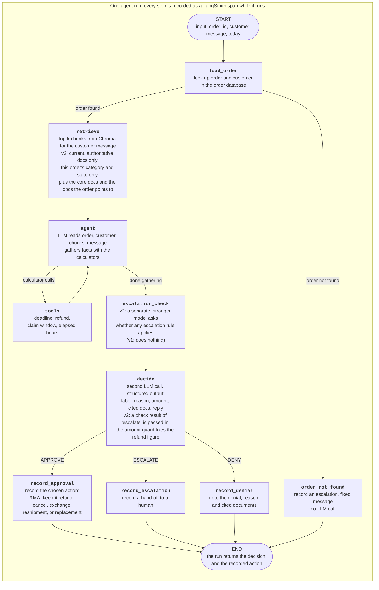

# Agent run flow (as built)

What happens for one customer request, in v2 (the default; D-091). v1 is the same graph with the v2 settings off (`src/agent/versions.py`). This matches the graph in `src/agent/graph.py` and the nodes in `src/agent/nodes.py`. The whole run is traced in LangSmith as it executes (each step is a span, sent in the background), not at the end. The eval loop is in `eval-loop.md`.

## Where the decision is made
The `decide` step makes the decision. It is a second model call whose output is forced to match the decision schema, so it is always valid: the label, the reason code, the item condition, the refund amount, the return deadline, the action to carry out or the escalation type, the cited documents, and the reply to the customer. The graph then routes on the label. What happens next is recorded by code, not by the model: an action for an approval or an escalation, and a note for a denial. So the recorded entry always matches the decision, and a normal run records exactly one entry. The one exception is an APPROVE where the model names no action to carry out: nothing is recorded, and the evals flag it.

The `agent` step only gathers facts. Its calculator calls and closing analysis are input to `decide`.

## Notes
- The steps share one state (a LangGraph state object). Each step adds to it and passes it on, so the agent step sees the customer message, the order, and the retrieved chunks without a separate arrow for each.
- The model only calls calculators. Everything that is recorded as an action (RMA, keep-it refund, cancellation, exchange, escalation, denial) is written into the state by the record nodes after the decision.
- How untrusted text is handled (OPS-07): there is no separate step. The LLM prompt treats the message as data, `order_id` and `today` are structured inputs never read from the message, and the model cannot act at all: it can only call calculators and, in `decide`, produce a decision that code then carries out.
- Assumed decisions: single turn (D-005), no identity verification (D-020), three labels only, so "need more info" and "wait 48 hours" become ESCALATE (D-006), abuse flag escalates even for an ineligible item and the $250 limit is on the net refund (D-008).
- Authority checks (refund over $250, jewelry $500 or more, abuse thresholds, always-escalate triggers) are not code and hold no policy numbers (D-085). In v1 they were left to the agent, which missed many. In v2 the `escalation_check` step asks a stronger model one narrow question about them (it sees the excerpts, the order and customer facts, the calculator results, and the message, not the agent's reasoning), and the decision step follows its answer. The model for that step is `OPENAI_ESCALATION_CHECK_MODEL`.
- The v2 settings (D-067 to D-089): core and order-driven documents added by rule, a search that skips stale and non-authoritative documents and other categories' and states' documents, a grounding rule in the prompt, an amount guard (an approved refund must be a calculator result; no refund on a denial or escalation), and the escalation check.
- Known weaknesses of v2 are in the README and in `DECISIONS.md` (D-090 in particular: the seasonal calendar SEA-01 in the core set makes the agent apply Fall Gear-Up to orders placed before it starts).
- The tool loop is bounded by the graph's step limit (20).
