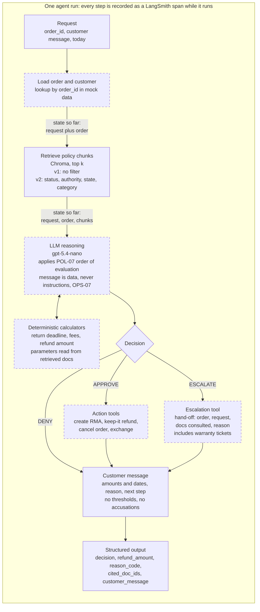

# Agent run flow (planned)

What happens for one customer request. The whole run is traced in LangSmith as it executes (each step is a span, sent in the background), not at the end. Solid boxes are decided. Dashed boxes are planned or undecided. Only the retriever and the index are built today. The eval loop is in `eval-loop.md`.

Decisions this diagram assumes: single turn (D-005), no identity verification step (D-020), three labels only, so "need more info" and "wait 48 hours" become ESCALATE (D-006), abuse flag escalates even for an ineligible item and the $250 limit is on the net refund (D-008).

The steps share one state (a LangGraph state object). Each step adds to it and passes it on, so the LLM step sees the customer message, the order, and the retrieved chunks without a separate arrow for each.

How untrusted text is handled (OPS-07): there is no separate step. The LLM prompt treats the message as data, `order_id` and `today` are structured inputs never read from the message, and the LLM can only act through the action tools, with amounts and dates coming from the calculators.

Open design choice: where the authority checks live (refund over $250, jewelry $500 or more, abuse thresholds, always-escalate triggers). They are drawn inside the LLM step, working from the retrieved OPS docs. Moving them into deterministic code after the LLM step would be a safer alternative, but it puts policy in code.
