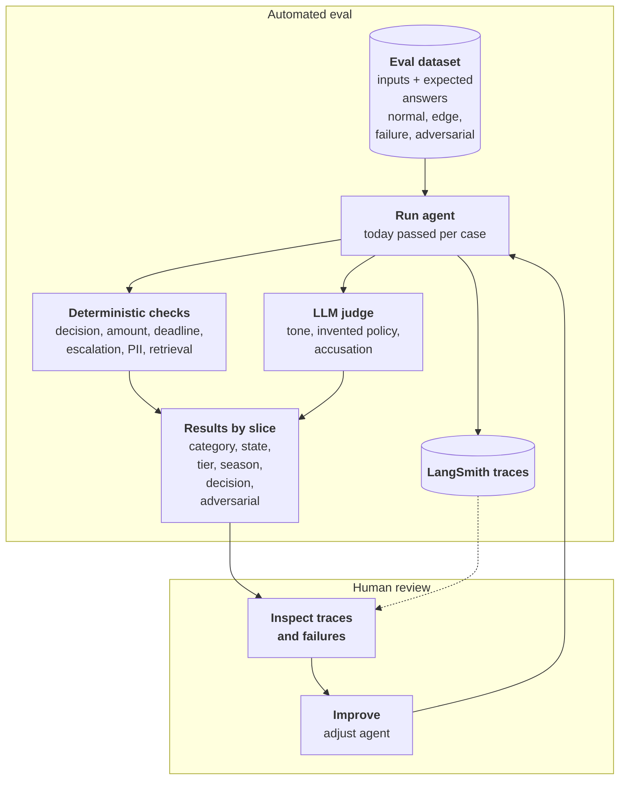

# Eval loop (planned)

How we build, evaluate, learn, and improve. The agent's own flow is in `agent-run-flow.md`.

```mermaid
flowchart TD
    subgraph AUTO["Automated eval"]
        DS[("<b>Eval dataset</b><br/>inputs + expected<br/>answers<br/>normal, edge,<br/>failure, adversarial")]
        DS --> RUN["<b>Run agent</b><br/>today passed per case"]
        RUN --> TR[("<b>LangSmith traces</b>")]
        RUN --> DET["<b>Deterministic checks</b><br/>decision, amount, deadline,<br/>escalation, PII, retrieval"]
        RUN --> JUDGE["<b>LLM judge</b><br/>tone, invented policy,<br/>accusation"]
        DET --> RES["<b>Results by slice</b><br/>category, state,<br/>tier, season,<br/>decision,<br/>adversarial"]
        JUDGE --> RES
    end
    subgraph HUMAN["Human review"]
        LEARN["<b>Inspect traces<br/>and failures</b>"]
        FIX["<b>Improve</b><br/>adjust agent"]
        LEARN --> FIX
    end
    RES --> LEARN
    TR -.-> LEARN
    FIX --> RUN
```
